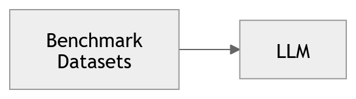
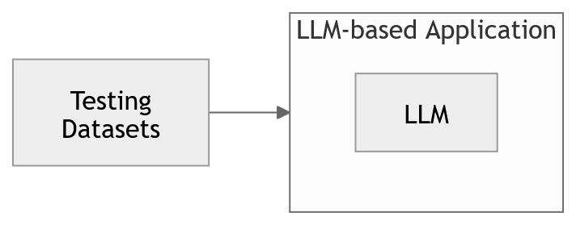
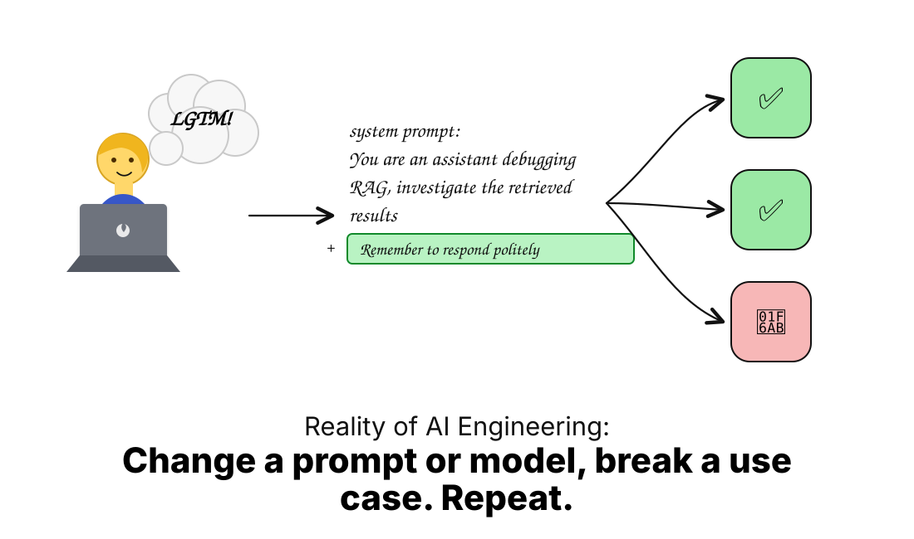

# Evaluación de modelos vs evaluación de sistemas

Los agentes de IA son aplicaciones de software impulsadas por modelos de lenguaje (LLMs). Sin embargo, evaluar este tipo de sistemas no es equivalente a evaluar software tradicional.

En términos generales, existen dos niveles de evaluación:

> **evaluación del modelo vs evaluación del sistema**

---

## Evaluación de modelos (LLM Model Evaluation)

**Figura 4.** Evaluación de modelos de lenguaje utilizando datasets de benchmark.

La evaluación de modelos se centra en medir qué tan bien un modelo de lenguaje realiza tareas específicas.

Se utilizan datasets estandarizados (*benchmarks*) para evaluar capacidades generales como:
- razonamiento  
- comprensión  
- generación de código  

Ejemplos comunes incluyen:
- **MMLU**: preguntas en múltiples dominios (matemáticas, medicina, filosofía, etc.)  
- **HumanEval**: generación de código  

Estos benchmarks son utilizados frecuentemente por proveedores para comparar modelos.

---

## Evaluación de sistemas (LLM System Evaluation)

**Figura 5.** Evaluación de una aplicación completa basada en LLMs.

En contraste, la evaluación de sistemas mide qué tan bien funciona una **aplicación completa**, donde el LLM es solo un componente.

Aquí se evalúa el sistema completo, incluyendo:
- prompts  
- herramientas  
- memoria  
- routing  
- lógica de negocio  

Los datasets utilizados pueden ser:
- creados manualmente  
- generados automáticamente  
- sintetizados  
- derivados de datos reales  

El objetivo es responder:
- ¿El sistema cumple con los requerimientos del usuario?
- ¿Funciona correctamente en escenarios reales?

---

## Software tradicional vs sistemas basados en LLM

En software tradicional, los sistemas son en gran medida **deterministas**.

Se pueden entender como:
> 🚆 un tren sobre rieles

- hay un inicio y un final claro  
- es fácil verificar si cada componente funciona  
- los resultados son reproducibles  

En este contexto:
- **unit tests** validan componentes individuales  
- **integration tests** validan el sistema completo  

---

En contraste, los sistemas basados en LLM son **no deterministas**.

Se pueden entender como:
> 🚗 conducir en una ciudad con tráfico

- el entorno es variable  
- el mismo input puede producir outputs diferentes  
- el comportamiento depende del contexto  

Esto implica que:
- no siempre es posible usar evaluaciones binarias (pass/fail)  
- se requieren métricas más cualitativas  

---

## Tipos comunes de evaluación en sistemas LLM

Algunos de los aspectos más importantes a evaluar incluyen:

- **Hallucination**  
  ¿El modelo inventa información o usa correctamente el contexto?

- **Retrieval relevance**  
  ¿Los documentos recuperados son relevantes?

- **Question answering accuracy**  
  ¿La respuesta coincide con el ground truth?

- **Toxicity**  
  ¿El output contiene lenguaje inapropiado o dañino?

- **Overall performance**  
  ¿El sistema cumple su objetivo?

Existen herramientas y datasets (incluyendo open-source) que permiten medir estos aspectos y diseñar evaluaciones personalizadas.

---

## Cuando pasamos a agentes

Cuando evolucionamos de una aplicación basada en LLM a un **agente**, la complejidad aumenta.

Un agente es:

> un sistema que utiliza un LLM para razonar y tomar acciones en nombre del usuario :contentReference[oaicite:0]{index=0}

---

### Componentes de un agente

Un agente típicamente incluye:

1. **Reasoning**  
   (razonamiento con el LLM)

2. **Routing**  
   (decidir qué herramienta usar)

3. **Action**  
   (ejecutar la herramienta, API o código)

---

## Ejemplo: agente que planea un viaje

Supongamos que un agente debe ayudarte a reservar un viaje.

El proceso incluye:

1. Decidir qué herramienta usar  
2. Construir la consulta adecuada  
3. Llamar APIs (vuelos, hoteles, etc.)  
4. Refinar la búsqueda  
5. Generar una respuesta final  

---

## ¿Cómo evaluamos un agente?

Aquí es donde entra la evaluación detallada por pasos:

- ¿Seleccionó la herramienta correcta?  
- ¿Usó los parámetros adecuados?  
- ¿Interpretó correctamente el contexto del usuario?  
- ¿La respuesta final es correcta y útil?  

Un error puede aparecer en múltiples niveles:
- herramienta incorrecta  
- parámetros incorrectos  
- uso incorrecto del contexto  
- tono inadecuado  
- información incorrecta  

---

## Idea clave

> No basta con evaluar la salida final.  
> Hay que evaluar **cada decisión del agente**.

---

## Evaluación con humanos y LLMs

Para evaluar estos sistemas se pueden usar:

- **Human-in-the-loop**  
  evaluación directa por personas  

- **LLM-as-a-judge**  
  otro modelo evalúa la calidad de la respuesta  

---

## Importancia de los datasets de evaluación

Pequeños cambios pueden generar efectos inesperados:

**Figura 6.** Cambios pequeños en el sistema (por ejemplo, modificar un prompt) pueden mejorar algunos casos mientras degradan otros. Este fenómeno se conoce como regresión.

Por ejemplo:
- mejorar un caso → empeorar otro  
- cambiar un prompt → afectar múltiples outputs  
---

## Evaluación iterativa

Al igual que en software tradicional, el desarrollo de agentes requiere iteración:

- ejecutar evaluaciones  
- analizar resultados  
- ajustar prompts, herramientas o lógica  
- repetir  

Sin embargo, a diferencia del software clásico:
- el sistema es no determinista  
- puede mejorar en un caso y empeorar en otro  

---

## Observabilidad y trazas

Una práctica fundamental es recolectar **trazas (traces)** del comportamiento del agente:

- qué decisiones tomó  
- qué herramientas usó  
- qué pasos siguió  

Esto permite:
- entender el sistema  
- depurar errores  
- mejorar componentes específicos  

---

## Conclusión

Evaluar sistemas basados en LLM y agentes requiere un cambio de mentalidad:

- de evaluación determinista  
→ a evaluación probabilística  

- de caja negra  
→ a sistema observable  

- de evaluación final  
→ a evaluación por componentes y trayectoria  

Este enfoque es esencial para construir sistemas robustos en escenarios reales.
