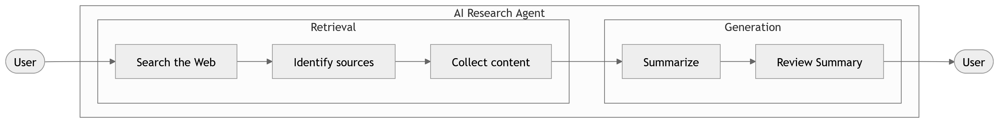
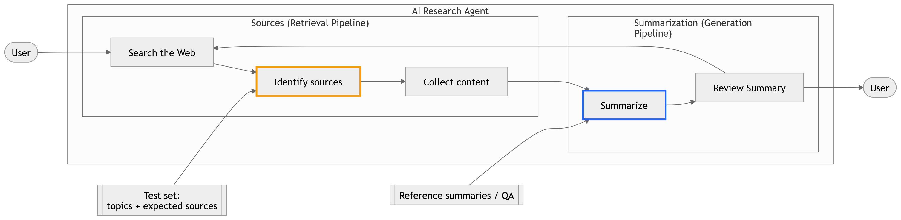
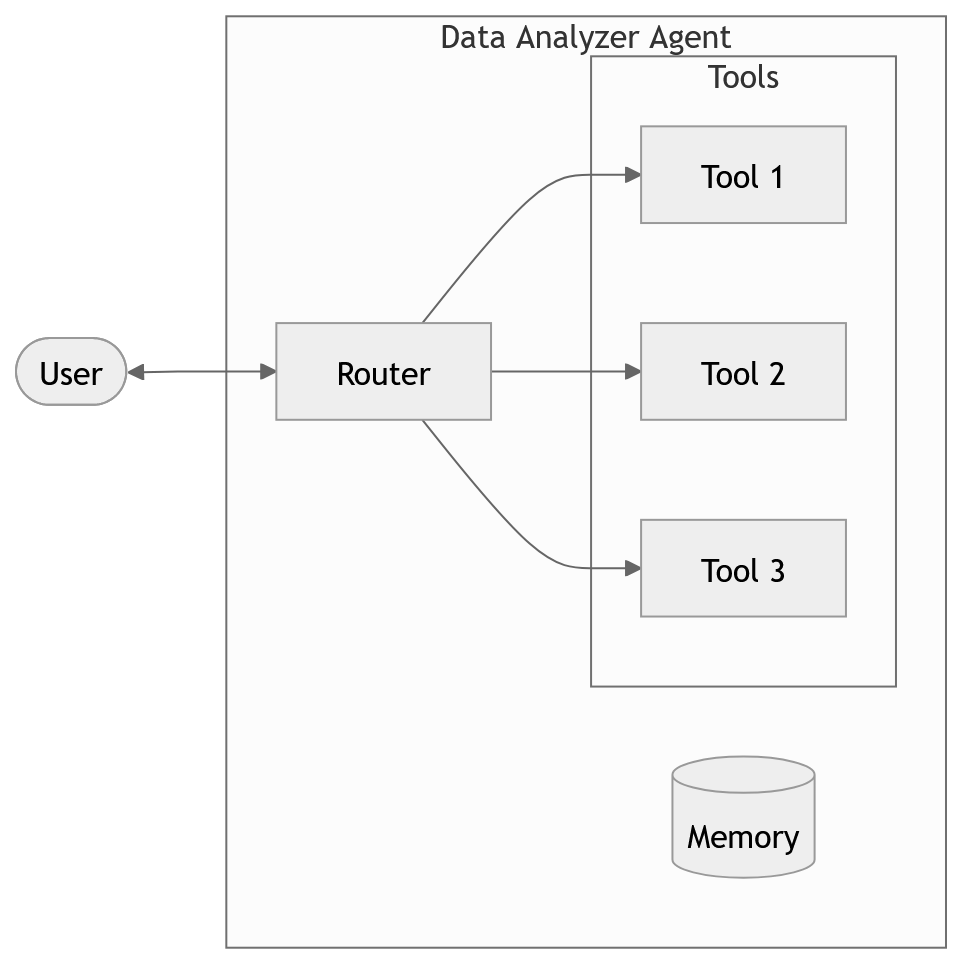

# Evaluación de Agentes de IA: de pipelines a sistemas observables

Los agentes de IA modernos no son funciones simples. Son **sistemas compuestos e iterativos** que combinan razonamiento, uso de herramientas y generación de lenguaje natural. En lugar de producir una salida en un solo paso, ejecutan ciclos donde planifican, actúan y refinan sus resultados.

Este cambio de paradigma introduce un reto fundamental:  
**¿cómo evaluamos correctamente un sistema que no es lineal ni monolítico?**

Adoptar un enfoque de *evaluation-driven development* permite abordar este problema de manera estructurada. En lugar de iterar de forma empírica (probar cambios sin saber su impacto), podemos analizar el comportamiento del agente paso a paso, identificar fallos y mejorar el sistema de forma dirigida.

---

## Arquitectura básica de un agente

**Figura 1.** Arquitectura básica de un agente con ciclo iterativo (*Plan → Tools → Reflect*). Este patrón permite que el agente refine su comportamiento mediante retroalimentación interna, incrementando la calidad de la solución a través de múltiples pasos.

Este ciclo introduce tres capacidades clave:
- **Planificación**: descomposición del problema  
- **Acción**: interacción con herramientas externas (APIs, código, bases de datos)  
- **Reflexión**: evaluación interna y corrección de errores  

Desde una perspectiva de evaluación, cada uno de estos componentes puede fallar de manera independiente.

---

## El problema de evaluar solo el resultado final

Una práctica común es evaluar únicamente la salida final del agente. Sin embargo, esto es insuficiente.

Supongamos que un agente genera un mal resultado. ¿Dónde está el error?
- ¿Falló el razonamiento inicial?
- ¿Seleccionó mal una herramienta?
- ¿Usó datos incorrectos?
- ¿O el problema está en la generación final?

Sin visibilidad interna, todas estas causas se mezclan. Esto dificulta la mejora sistemática del sistema.

Aquí es donde entra el concepto clásico de **análisis de errores**, adaptado a sistemas agenticos.

---

## Evaluación a nivel de componentes

**Figura 2.** Descomposición del agente en dos pipelines principales: *retrieval* (obtención de información) y *generation* (síntesis). Cada uno se evalúa con criterios distintos y datasets específicos.

En sistemas como agentes de investigación, podemos separar claramente dos etapas:

### 1. Retrieval (fuentes)
Incluye:
- Búsqueda
- Identificación de fuentes
- Recolección de contenido  

Este bloque puede evaluarse utilizando:
- Conjuntos de prueba con **fuentes esperadas**
- Métricas como:
  - Precision@k  
  - Recall@k  
  - nDCG  

### 2. Generation (síntesis)
Incluye:
- Resumen
- Revisión de la respuesta  

Este bloque se evalúa mediante:
- Métricas automáticas (ROUGE, BERTScore)
- Evaluación con modelos (*LLM-as-a-judge*)
- Validación basada en preguntas/respuestas (factualidad)

---

## Evaluar el proceso, no solo el resultado

Además del resultado final, es fundamental evaluar la **trayectoria del agente**:

- ¿El agente entra en bucles?
- ¿Repite pasos innecesarios?
- ¿Usa herramientas de forma eficiente?
- ¿Converge hacia una solución?

Esto introduce una dimensión adicional de evaluación:
> **calidad del proceso (trajectory evaluation)**

---

## Idea clave

> **Muchos errores en la salida final no son errores de generación, sino de recuperación de información.**

Esta distinción es crítica. Sin separar retrieval y generation:
- Se pueden optimizar componentes equivocados  
- Se pueden introducir cambios innecesarios  
- Se pierde eficiencia en el desarrollo  

---

## Conclusión

Evaluar agentes de IA requiere cambiar la forma en que pensamos los sistemas:

- De evaluación *end-to-end*  
→ a evaluación **factorizada por componentes**

- De prueba y error  
→ a **mejora guiada por métricas**

- De sistemas opacos  
→ a sistemas **observables e interpretables**

Este enfoque no solo mejora la calidad del agente, sino que permite escalar su desarrollo de manera controlada y reproducible.

## Caso de estudio: Data Analyzer Agent

**Figura 3.** Arquitectura de un agente analizador de datos basado en herramientas. Un *router* decide qué herramienta utilizar en función de la consulta del usuario, apoyándose en memoria para mantener el contexto.

Hasta ahora hemos discutido cómo evaluar agentes de forma general. En esta sección aterrizamos estos conceptos en un sistema concreto: un **Data Analyzer Agent**.

Este agente tiene como objetivo responder preguntas del usuario mediante análisis de datos. Para ello, no depende únicamente de generación de texto, sino de la ejecución de herramientas especializadas.

---

## ¿Qué hace este agente?

Dado un *prompt* del usuario, el agente:

1. **Interpreta la consulta**  
   Determina la intención (por ejemplo: consulta, agregación, filtrado, visualización).

2. **Selecciona una herramienta (router)**  
   Decide cuál de las herramientas disponibles es más adecuada:
   - consultas a base de datos  
   - transformaciones de datos  
   - generación de gráficos  
   - cálculos estadísticos  

3. **Extrae parámetros**  
   Traduce la intención del usuario en argumentos estructurados (por ejemplo: columnas, filtros, rangos de tiempo).

4. **Ejecuta la herramienta**  
   Obtiene resultados intermedios a partir de datos reales.

5. **Genera una respuesta**  
   Presenta los resultados de forma interpretable para el usuario.

6. **Mantiene contexto (memoria)**  
   Permite encadenar consultas y mantener coherencia en la conversación.

---

## ¿Qué vamos a aprender evaluando este agente?

Este caso de estudio nos permite introducir una evaluación más rica que en los ejemplos anteriores.

### 1. Evaluación del router (decisión)

- ¿El agente selecciona la herramienta correcta?
- ¿Qué tan consistente es esta decisión?

Métricas:
- Accuracy de selección de herramienta  
- Confusión entre herramientas  

---

### 2. Evaluación de parámetros

- ¿Los argumentos extraídos son correctos?
- ¿Reflejan correctamente la intención del usuario?

Evaluación:
- Exact match  
- Validación semántica  

---

### 3. Evaluación de herramientas

- ¿Cada herramienta funciona correctamente de forma aislada?
- ¿Produce resultados esperados?

Esto permite aislar errores del sistema:
- error de herramienta vs error del agente  

---

### 4. Evaluación de la trayectoria

- ¿El agente toma una secuencia eficiente de decisiones?
- ¿Evita pasos innecesarios o redundantes?

Esto introduce:
> **evaluación del proceso**, no solo del resultado

---

### 5. Evaluación end-to-end

Finalmente:
- ¿La respuesta final es correcta y útil para el usuario?

Pero ahora, a diferencia de antes:
- podemos **atribuir errores a componentes específicos**

---

## Idea clave

> Este agente introduce una nueva dimensión: **la toma de decisiones estructurada**.

No solo evaluamos:
- qué información usa el agente  
- qué texto genera  

Sino también:
- **qué acciones decide ejecutar**

---

## Conexión con el curso

A lo largo del desarrollo de este agente, aprenderemos a:

- Instrumentar el sistema para capturar trazas  
- Evaluar cada componente de forma independiente  
- Diseñar evaluadores específicos (router, tools, output)  
- Integrar todo en experimentos reproducibles  

Este será el hilo conductor para entender cómo construir y mejorar agentes de IA en escenarios reales.
