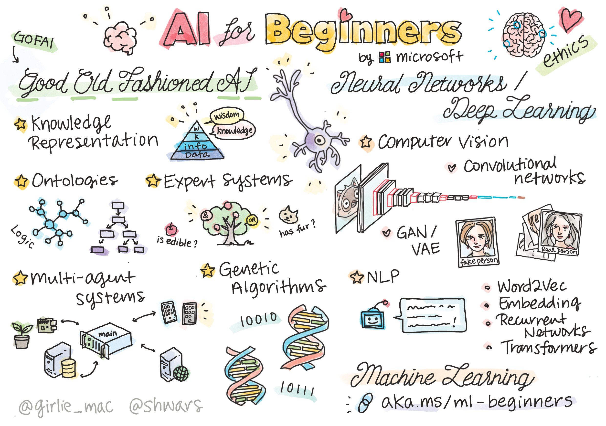

# CM0091 - Artificial Intelligence

Course Repository CM0091 Artificial Intelligence at Universidad EAFIT

> Sketchnote by [Tomomi Imura](https://twitter.com/girlie_mac)

# What you will learn in this course

In this course, students will acquire a **comprehensive and practice-oriented understanding of Artificial Intelligence**, covering classical foundations, modern learning-based approaches, and contemporary generative and agent-based systems.

Specifically, the course covers:

- **Foundations of Artificial Intelligence**, including intelligent agents, problem formulation, uninformed and heuristic search, constraint satisfaction problems, and classical planning.
- **Machine Learning and Deep Learning**, with an emphasis on supervised learning pipelines, decision trees and ensembles, neural networks, and deep learning fundamentals implemented using **PyTorch**.
- **AI for perception and language**, including computer vision with pre-trained convolutional networks, and natural language processing with transformers and zero-shot capabilities.
- **Contemporary AI practice**, including **Generative AI**, scaling laws, large language models, agent-based systems, multimodality, and modern AI engineering practices such as reproducibility, deployment, and responsible AI.
- **Integration and evaluation**, through an end-to-end AI project that consolidates technical, ethical, and engineering considerations.

---

## Evaluation

The evaluation is organized by modules and combines quizzes, theoretical–practical reports, and a final integrative project. The final grade corresponds to the weighted sum of the following components:

| Module / Event | Evaluation | % | Timeline | Dates |
|---------------|------------|---|----------|-------|
| **Module 1 – Foundations, Search & Planning** | Quiz | 5 | Week 4 | August 4 to 9 |
| | Theoretical and practical report | 20 | Week 5 | August 11 to 16 |
| **Module 2 – The Learning Lens** | Quiz | 5 | Week 8 | September 1 to 6 |
| | Theoretical and practical report | 20 | Week 9 | September 8 to 13 |
| **Module 3 – Contemporary Practice** | Quiz | 5 | Week 12 | September 29 to October 4 |
| | Theoretical and practical report | 20 | Week 13 | October 13 to 18 |
| **Module 4 – Evaluation & Integration** | Final project and report (AI Agent) | 25 | Week 16 | November 3 to 8 |

---

### Notes for students

- Reports emphasize **both conceptual understanding and implementation**.
- The final project integrates **Generative AI, agents, and system-level design**.
- The use of **Generative AI tools is permitted**, subject to transparency and academic integrity, as stated in the course policies.

### Lecture 01
- [Lecture01.pdf](Lecture01/Lecture_01.pdf) — Introduction to AI
- Homework:
  - Review the [numpy notebook](Lecture01/notebooks/tools_numpy.ipynb)
  - Review the [pandas notebook](Lecture01/notebooks/tools_pandas.ipynb)
  - Review the [matplotlib notebook](Lecture01/notebooks/tools_matplotlib.ipynb) 

# Resources:
* Computational resources: I strongly recommend creating (free) accounts on the following platforms:
  - [Google collaborative](https://colab.research.google.com/)
  - [HuggingFace](https://huggingface.co/)
  - [Kaggle](https://www.kaggle.com/)
  - [LightingAI](https://lightning.ai/)
  - [Weights and Biases](https://wandb.ai/site)
  
* Artificial Intelligence Books:
  - [Artificial Intelligence: A Modern Approach](https://aima.cs.berkeley.edu/)
  - [Artificial Intelligence with Python: A Comprehensive Guide to Building Intelligent Apps for Python Beginners and Developers](https://www.amazon.com/Artificial-Intelligence-Python-Comprehensive-Intelligent/dp/178646439X)

 

 
                                                  

  

